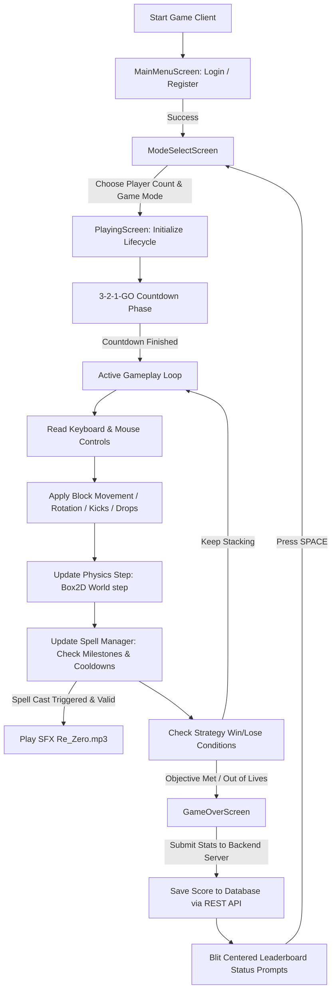

# Chaotic Tower 🧱🔮

A physics-based competitive tower-stacking game inspired by Tricky Towers and Tetris. Built with a modular monorepo architecture, the game features realistic Box2D physics, real-time local multiplayer, randomized magic spells, endless and objective-driven game modes, and secure online accounts with competitive global leaderboards.

---

## Key Features

### 🕹️ Real-Time Physics Stacking
*   **Box2D Physics Integration:** Realistic gravity, mass, linear/angular dampening, and high-friction grip ensure towers feel solid, massive, and highly responsive.
*   **Drift-Free Grid Descent:** Advanced physics-stepping prevents horizontal drifting or sub-pixel nudging when blocks collide mid-air, guaranteeing pristine vertical snaps.
*   **Dynamic Wall Kicks:** Allows natural, intuitive rotations even when block fixtures are flush against boundaries or existing walls.
*   **7-Bag Randomizer Parity:** Utilizes individual 7-bag queues to guarantee equal shape distribution for competitive multiplayer fairness.

### 🎭 Objective-Driven Game Modes
*   **Survival Mode:** Stack as high as you can with a limited pool of 3 lives. Dropping blocks out-of-bounds deducts lives.
*   **Puzzle Mode (Identical Sequence Sync):** Stack block shapes as densely as possible below a red pulsing laser target line. Dropping blocks triggers a penalty, raising the floor. To ensure 100% fair competition, P1 and P2 share a **perfectly synced block sequence**; whichever player builds faster dynamically triggers a shared 7-bag expansion, matching upcoming shapes perfectly.
*   **Race Mode (Speedrun):** Reach a 20m checkered target banner at your own pace. Enjoy infinite lives (no heart deductions) and track live progress metrics ("To Go" distance) directly on the HUD.

### 🔮 Mystery Magic Spell System (Multiplayer)
*   Granted at 4-meter height milestones and randomized with equal probability. Spells are completely hidden on the HUD under a glowing cyan `MAGIC READY` prompt, revealing their true nature only upon casting.
*   **Light Spells (Self Buffs):**
    *   *Cement Spell:* Instantly petrifies your last block into an immovable stone body (grey visual tint).
    *   *Ivy Spell:* Welds your top two blocks together with standard Box2D joints (green visual tint).
    *   *Lightning Spell:* Destroys your last placed block to correct vertical mistakes.
*   **Dark Spells (Opponent Debuffs):**
    *   *Frost Spell:* Bypasses standard friction checks to freeze your opponent's active block (0.02f low friction ice blue tint).
    *   *Weight Spell:* Spawns a giant, doubled-mass block (scale 2.0) that easily destabilizes active towers.
    *   *Speed Up Spell:* Triples the downward descent rate of your opponent's block.
*   Includes a strictly enforced **15-second cooldown** system with visual live timers on the HUD.

### 📊 Competitive Global Leaderboards
*   Accessible seamlessly from the Login Screen or Mode Selector with sleek, purple-tinted hover controls.
*   **Survival:** Ranks top 10 players by maximum height in meters and elapsed time.
*   **Race:** Ranks players by speed run completion time (lower milliseconds are better, sorted ascending).
*   **Puzzle:** Ranks players by dense block placement count (sorted descending).

---

## Tech Stack

### Frontend (Game Client)
*   **Engine Core:** Java with [LibGDX](https://libgdx.com/) framework.
*   **Physics Engine:** Box2D physics solver.
*   **Window Management:** LWJGL3 backend.
*   **Graphics & HUD:** OpenGL-based Viewports (`FitViewport`), full-screen custom UI cards, high-fidelity textured checkpoints (checkered banner), and custom TrueType font renderers.
*   **Audio Engine:** Streamed background looping music (`tetris.mp3`) with window focus listeners and dynamic spell casting sound effects (`Re_Zero.mp3`).

### Backend (Game Server)
*   **Framework:** Spring Boot REST API.
*   **Data Layer:** Spring Data JPA with Hibernate.
*   **Database:** PostgreSQL.
*   **Authentication:** Dedicated secure login and register controllers with unique constraint verifications and hashed credentials matching.

---

## Directory Structure

```text
chaoticTower/
│
├── frontend/                     # LibGDX Game Project
│   ├── assets/                   # Textures, Fonts, BGM (tetris.mp3), SFX (Re_Zero.mp3)
│   ├── core/src/main/java/       # Game Core source (screens, entities, physics logic)
│   └── lwjgl3/                   # LWJGL3 Desktop Launcher configurations
│
├── backend/                      # Spring Boot Server Project
│   └── chaoticTower-server/      # Server source (entities, repositories, REST controllers)
│
└── PROJECT_CONTEXT.md            # Reference documentation & system specs
```

---

## How to Set Up & Run

### 🗄️ 1. PostgreSQL Database Configuration
1.  Ensure you have a PostgreSQL server running on port `5432`.
2.  Create a database named `chaotictower`.
3.  Set your system environment variable `DB_PASSWORD` matching your PostgreSQL database password.

### 💻 2. Launch the Backend Server
Navigate to the server directory and boot the Spring Boot application:
```bash
cd backend/chaoticTower-server
.\gradlew.bat bootRun
```
*At startup, the server automatically maps your database tables via Hibernate DDL and seeds the default player account `alfa` with password `alfa`.*

### 🎮 3. Launch the Game Client
Navigate to the frontend directory and start the desktop launcher:
```bash
cd frontend
.\gradlew.bat lwjgl3:run
```

---

## System Architecture & Diagrams

To help understand the database schema and game client loop, we provide the following Entity-Relationship Diagram (ERD) and Game Loop Flowchart.

### 📊 Entity-Relationship Diagram (ERD)
```mermaid
erDiagram
    players {
        bigint id PK
        varchar username UNIQUE
        varchar password
    }
    achievements {
        bigint id PK
        varchar name UNIQUE
        varchar description
    }
    leaderboard {
        bigint id PK
        bigint player_id FK
        varchar game_mode
        integer score
        double time_record
        double max_height
    }
    player_achievements {
        bigint id PK
        bigint player_id FK
        bigint achievement_id FK
        timestamp unlocked_at
    }

    players ||--o{ leaderboard : "submits"
    players ||--o{ player_achievements : "earns"
    achievements ||--o{ player_achievements : "details"
```

### 🔁 Game Loop & Lifecycle Flowchart


---

## Future Improvements

While the game is fully operational and feature-complete, here are the recommended next steps and roadmap enhancements:

*   **Particle Effects Engine:** Integrate a particles framework to render glowing visual feedback during block landing contacts (settling dust), block lightning zaps (destruction sparks), and spell casts.
*   **Sprite-Based Block Textures:** Replace the current geometric `ShapeRenderer` rect-based drawing calls with premium, sprite-sheet textured block styles (like brick, wood, and stone tiles) to offer high-fidelity retro graphics.
*   **Achievement Tracking & Frontend UI:** Implement a dedicated Achievements UI screen in the frontend to fetch and display unlocked trophies and milestones (which are already supported in the backend server API/database layers).
*   **Granular SFX Feedback:** Add minor audio cues for block collisions, rotation commands, and soft drop impacts to enhance soundscape depth alongside the main BGM and magic spells.
