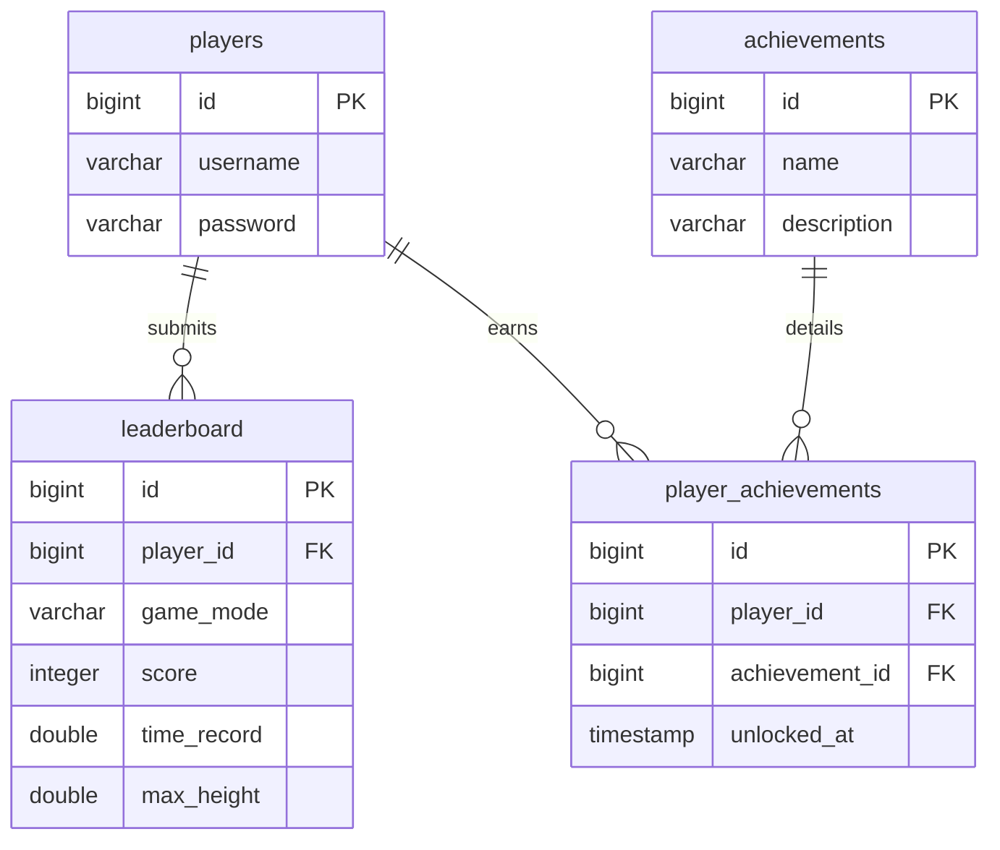
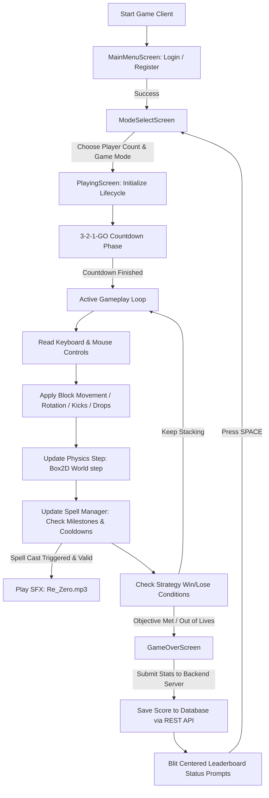

# Chaotic Tower

```bash
Nama    : Danish Al Fayyadh Sunarta
NPM     : 2406416951
```

Chaotic Tower merupakan game *physics-based competitive tower-stacking* yang terinspirasi oleh Tricky Towers dan Tetris. Dibangun menggunakan arsitektur *monorepo* yang modular, game ini menghadirkan *Box2D physics* yang realistis, *real-time local multiplayer*, *randomized magic spells*, berbagai *game modes* yang bersifat objective-driven, serta fitur *secure online accounts* dengan *global leaderboards*.

---

## Key Features

### Game Modes
*   **Survival Mode:** Susun balok setinggi mungkin dengan jumlah *lives* yang terbatas (3 nyawa). Balok yang jatuh ke luar area akan mengurangi lives.
*   **Puzzle Mode (Identical Sequence Sync):** Susun balok sepadat mungkin di bawah garis target. Balok yang jatuh akan memicu penalti yang menurunkan garis target. Agar adil, Player 1 (P1) dan Player 2 (P2) mendapatkan urutan bentuk balok yang persis sama.
*   **Race Mode (Speedrun):** Capai garis *finish* setinggi 20 meter secepat mungkin.

### Magic Spell (Multiplayer)
*   Didapatkan setiap kali mencapai *height milestone* kelipatan 4 meter dan diacak dengan chance yang seimbang. Jenis *spell* disembunyikan sepenuhnya pada *HUD* dengan indikator cyan menyala bertuliskan `MAGIC READY`, dan jenis aslinya baru akan terungkap saat *spell* di-cast*.
*   **Light Spells (Self Buffs):**
    *   *Cement Spell:* Mengubah balok terakhir menjadi immovable static, ditandai dengan warna abu-abu.
    *   *Ivy Spell:* Merekatkan dua balok teratas secara permanen menggunakan *Box2D joints* standar, ditandai dengan warna hijau tumbuhan.
    *   *Lightning Spell:* Menghancurkan balok terakhir yang ditempatkan untuk memperbaiki kesalahan.
*   **Dark Spells (Opponent Debuffs):**
    *   *Frost Spell:* Mengabaikan *friction* standar dan membekukan balok aktif lawan menjadi es yang sangat licin (*friction* 0.02f, ditandai dengan warna biru es).
    *   *Weight Spell:* Spawn balok raksasa dengan massa dua kali lipat (*scale* 2.0) yang dapat dengan mudah meruntuhkan menara lawan.
    *   *Speed Up Spell:* Meningkatkan kecepatan jatuh otomatis balok lawan sebanyak 3 kali lipat.
*   Dilengkapi dengan batasan waktu tunggu berupa **15-second cooldown** yang ditampilkan secara *real-time* di *HUD*.

### Leaderboards
*   Dapat diakses dengan mudah dari *Login Screen* maupun *Mode Selector* dilengkapi dengan efek visual sorot (*hover controls*) berwarna ungu yang modern.
*   **Survival:** Mengurutkan 10 pemain terbaik berdasarkan tinggi maksimum menara (dalam meter) dan waktu yang dihabiskan.
*   **Race:** Mengurutkan pemain berdasarkan waktu tercepat mencapai garis *finish* (nilai milidetik terkecil berada di atas secara *ascending*).
*   **Puzzle:** Mengurutkan pemain berdasarkan jumlah kepadatan balok yang berhasil ditempatkan di bawah garis laser (secara *descending*).

---

## Tech Stack

### Frontend (Game Client)
*   **Engine Core:** Java dengan *framework* [LibGDX](https://libgdx.com/).
*   **Physics Engine:** Modul *physics solver* Box2D.
*   **Window Management:** *LWJGL3 backend*.
*   **Graphics & HUD:** OpenGL-based Viewports (`FitViewport`), full-screen custom UI cards, garis target & finish, dan custom font.
*   **Audio Engine:** BGM diputar berulang terus-menerus (`tetris.mp3`) dilengkapi sound effect *spell* (`Re_Zero.mp3`).

### Backend (Game Server)
*   **Framework:** Spring Boot REST API.
*   **Data Layer:** Spring Data JPA dengan Hibernate.
*   **Database:** PostgreSQL.
*   **Authentication:** *Dedicated controller* untuk *secure login* dan *register* dengan validasi keunikan nama pengguna (*unique constraint*) dan pencocokan sandi terenkripsi.

---

## Directory Structure

```text
chaoticTower/
│
├── frontend/                     # Proyek Game LibGDX
│   ├── assets/                   # Aset Gambar, Font, BGM (tetris.mp3), SFX (Re_Zero.mp3)
│   ├── core/src/main/java/       # Kode Utama Game (screens, entities, logika fisika)
│   └── lwjgl3/                   # Konfigurasi Desktop Launcher LWJGL3
│
└── backend/                      # Proyek Server Spring Boot
    └── chaoticTower-server/      # Kode Utama Server (entities, repositories, REST controllers)
```

---

## How to Set Up & Run

### Cara Menjalankan Game (Pemain)
1. Unduh rilisan game terbaru dari itch.io (dalam bentuk file `.zip`).
2. Ekstrak file `.zip` tersebut di komputer Anda.
3. Jalankan langsung file executable (`.exe`) game yang ada di dalamnya.

*Catatan: Pemain tidak perlu melakukan setup database PostgreSQL lokal atau menjalankan backend server secara manual. Game client akan otomatis terhubung langsung ke backend server dan database yang sudah dideploy secara online di Railway.*

### Developer Mode
Jika Anda ingin menjalankan game dari source code:
1. Pastikan Anda memiliki Java JDK 17 terinstal.
2. Masuk ke direktori frontend:
   ```bash
   cd frontend
   ```
3. Jalankan launcher desktop menggunakan Gradle wrapper:
   ```bash
   .\gradlew.bat lwjgl3:run
   ```
   *Game client akan otomatis terhubung ke API server backend di Railway.*

---

## System Architecture & Diagrams

Untuk membantu memahami skema *database* dan *game client loop*, berikut adalah *Entity-Relationship Diagram* (ERD) serta *Game Loop Flowchart* yang menjelaskan arsitektur sistem game ini.

### ntity-Relationship Diagram (ERD)

```mermaid
erDiagram
    players {
        bigint id PK
        varchar username
        varchar password
    }
    achievements {
        bigint id PK
        varchar name
        varchar description
    }
    leaderboard {
        bigint id PK
        bigint player_id FK
        varchar game_mode
        integer score
        double time_record
        double max_height
    }
    player_achievements {
        bigint id PK
        bigint player_id FK
        bigint achievement_id FK
        timestamp unlocked_at
    }

    players ||--o{ leaderboard : submits
    players ||--o{ player_achievements : earns
    achievements ||--o{ player_achievements : details
```

### Game Loop & Lifecycle Flowchart

```mermaid
graph TD
    A["Start Game Client"] --> B["MainMenuScreen: Login / Register"]
    B -->|Success| C["ModeSelectScreen"]
    C -->|Choose Player Count & Game Mode| D["PlayingScreen: Initialize Lifecycle"]
    D --> E["3-2-1-GO Countdown Phase"]
    E -->|Countdown Finished| F["Active Gameplay Loop"]
    F --> G["Read Keyboard & Mouse Controls"]
    G --> H["Apply Block Movement / Rotation / Kicks / Drops"]
    H --> I["Update Physics Step: Box2D World step"]
    I --> J["Update Spell Manager: Check Milestones & Cooldowns"]
    J -->|Spell Cast Triggered & Valid| K["Play SFX: Re_Zero.mp3"]
    J --> L["Check Strategy Win/Lose Conditions"]
    L -->|Keep Stacking| F
    L -->|Objective Met / Out of Lives| M["GameOverScreen"]
    M -->|Submit Stats to Backend Server| N["Save Score to Database via REST API"]
    N --> O["Blit Centered Leaderboard Status Prompts"]
    O -->|Press SPACE| C
```

---

## Future Improvements

Meskipun game ini sudah fully operational, berikut beberapa future roadmap enhancements:

*   **Particle Effects Engine:** Integrasikan *particles framework* untuk menghasilkan umpan balik visual yang menyala saat balok bersentuhan dengan lantai/menara (*settling dust*), sambaran petir penghancur balok (*destruction sparks*), dan saat pelemparan *spells*.
*   **Sprite-Based Block Textures:** Ganti penggambaran geometris berbasis objek persegi `ShapeRenderer` saat ini dengan gambar bertekstur *sprite-sheet* premium (seperti desain ubin bata, kayu, dan batu) guna menghadirkan visual retro berkualitas tinggi.
*   **Achievement Tracking & Frontend UI:** Implementasikan layar antarmuka khusus *Achievements UI* di bagian *frontend* untuk mengambil dan menampilkan daftar trofi serta pencapaian yang telah dibuka (fitur ini sudah didukung secara penuh di sisi *backend server API* dan *database*).
*   **Granular SFX Feedback:** Tambahkan efek suara kecil untuk benturan balok, perintah rotasi, serta ketukan saat menjatuhkan balok (*soft drop*) demi meningkatkan kedalaman suasana suara (*soundscape*) di samping musik utama BGM dan *magic spells*.
