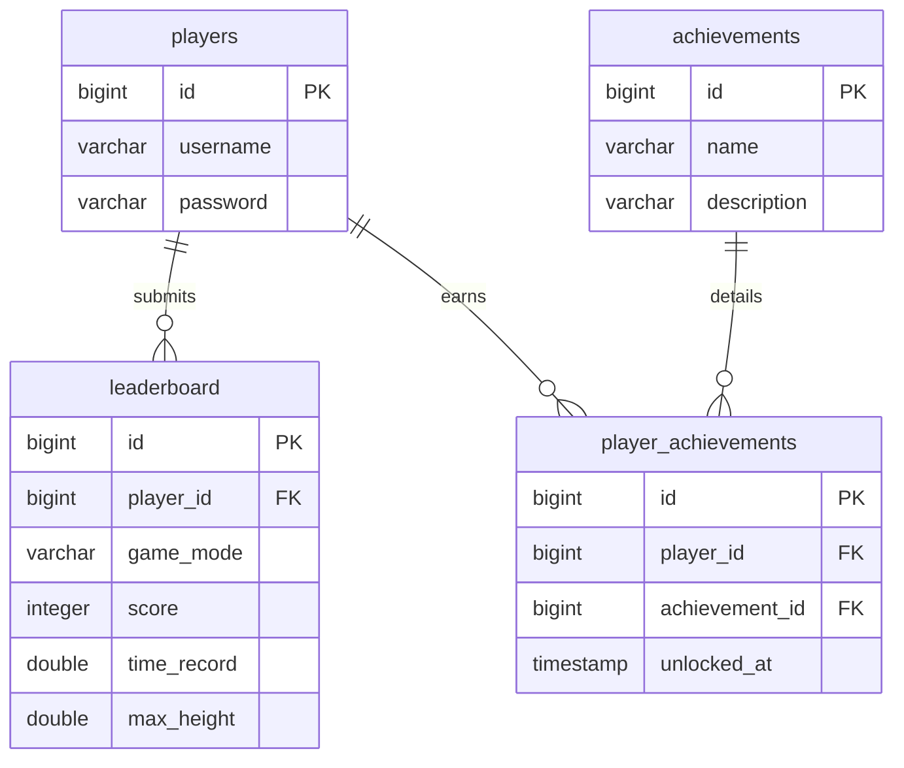
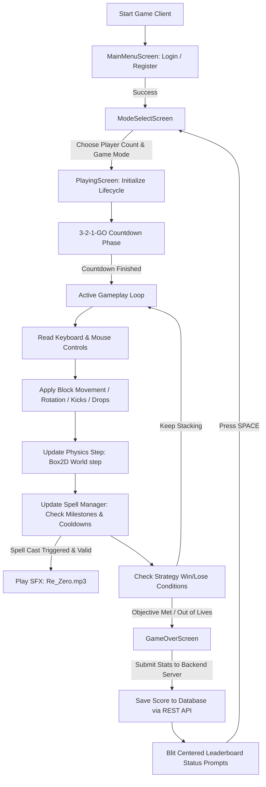

# Chaotic Tower

```bash
Nama    : Danish Al Fayyadh Sunarta
NPM     : 2406416951
```

Chaotic Tower merupakan game *physics-based competitive tower-stacking* yang terinspirasi oleh Tricky Towers dan Tetris. Dibangun menggunakan arsitektur *monorepo* yang modular, game ini menghadirkan *Box2D physics* yang realistis, *real-time local multiplayer*, *randomized magic spells*, berbagai *game modes* yang bersifat objective-driven, serta fitur *secure online accounts* dengan *global leaderboards*.

---

## Key Features

### Game Modes
*   **Survival Mode:** Susun balok setinggi mungkin dengan jumlah *lives* yang terbatas (3 nyawa). Balok yang jatuh ke luar area akan mengurangi lives.
*   **Puzzle Mode (Identical Sequence Sync):** Susun balok sepadat mungkin di bawah garis target. Balok yang jatuh akan memicu penalti yang menurunkan garis target. Agar adil, Player 1 (P1) dan Player 2 (P2) mendapatkan urutan bentuk balok yang persis sama.
*   **Race Mode (Speedrun):** Capai garis *finish* setinggi 20 meter secepat mungkin.

### Magic Spell (Multiplayer)
*   Didapatkan setiap kali mencapai *height milestone* kelipatan 4 meter dan diacak dengan chance yang seimbang. Jenis *spell* disembunyikan sepenuhnya pada *HUD* dengan indikator cyan menyala bertuliskan `MAGIC READY`, dan jenis aslinya baru akan terungkap saat *spell* di-cast*.
*   **Light Spells (Self Buffs):**
    *   *Cement Spell:* Mengubah balok terakhir menjadi immovable static, ditandai dengan warna abu-abu.
    *   *Ivy Spell:* Merekatkan dua balok teratas secara permanen menggunakan *Box2D joints* standar, ditandai dengan warna hijau tumbuhan.
    *   *Lightning Spell:* Menghancurkan balok terakhir yang ditempatkan untuk memperbaiki kesalahan.
*   **Dark Spells (Opponent Debuffs):**
    *   *Frost Spell:* Mengabaikan *friction* standar dan membekukan balok aktif lawan menjadi es yang sangat licin (*friction* 0.02f, ditandai dengan warna biru es).
    *   *Weight Spell:* Spawn balok raksasa dengan massa dua kali lipat (*scale* 2.0) yang dapat dengan mudah meruntuhkan menara lawan.
    *   *Speed Up Spell:* Meningkatkan kecepatan jatuh otomatis balok lawan sebanyak 3 kali lipat.
*   Dilengkapi dengan batasan waktu tunggu berupa **15-second cooldown** yang ditampilkan secara *real-time* di *HUD*.

### Leaderboards
*   Dapat diakses dengan mudah dari *Login Screen* maupun *Mode Selector* dilengkapi dengan efek visual sorot (*hover controls*) berwarna ungu yang modern.
*   **Survival:** Mengurutkan 10 pemain terbaik berdasarkan tinggi maksimum menara (dalam meter) dan waktu yang dihabiskan.
*   **Race:** Mengurutkan pemain berdasarkan waktu tercepat mencapai garis *finish* (nilai milidetik terkecil berada di atas secara *ascending*).
*   **Puzzle:** Mengurutkan pemain berdasarkan jumlah kepadatan balok yang berhasil ditempatkan di bawah garis laser (secara *descending*).

---

## Tech Stack

### Frontend (Game Client)
*   **Engine Core:** Java dengan *framework* [LibGDX](https://libgdx.com/).
*   **Physics Engine:** Modul *physics solver* Box2D.
*   **Window Management:** *LWJGL3 backend*.
*   **Graphics & HUD:** OpenGL-based Viewports (`FitViewport`), full-screen custom UI cards, garis target & finish, dan custom font.
*   **Audio Engine:** BGM diputar berulang terus-menerus (`tetris.mp3`) dilengkapi sound effect *spell* (`Re_Zero.mp3`).

### Backend (Game Server)
*   **Framework:** Spring Boot REST API.
*   **Data Layer:** Spring Data JPA dengan Hibernate.
*   **Database:** PostgreSQL.
*   **Authentication:** *Dedicated controller* untuk *secure login* dan *register* dengan validasi keunikan nama pengguna (*unique constraint*) dan pencocokan sandi terenkripsi.

### REST API Endpoints

| HTTP Method | Endpoint | Parameter / Path Variable | Fungsi |
| :--- | :--- | :--- | :--- |
| `POST` | `/api/players/login` | `username`, `password` (Query Params) | Melakukan autentikasi masuk player. |
| `POST` | `/api/players/register` | `username`, `password` (Query Params) | Mendaftarkan akun player baru. |
| `GET` | `/api/players/{id}` | `{id}` (Path Variable) | Mengambil informasi detail data player berdasarkan ID. |
| `POST` | `/api/leaderboard/submit` | `playerId`, `gameMode`, `score`, `timeRecord`, `maxHeight` (Query Params) | Mengirimkan skor dan statistik game ke leaderboard. |
| `GET` | `/api/leaderboard/top10` | `gameMode` (Query Param) | Mengambil 10 skor teratas untuk mode game tertentu. |
| `POST` | `/api/achievements/unlock` | `playerId`, `achievementName` (Query Params) | Membuka pencapaian (achievement) untuk player tertentu. |

---

## Directory Structure

```text
chaoticTower/
│
├── frontend/                     # Proyek Game LibGDX
│   ├── assets/                   # Aset Gambar, Font, BGM (tetris.mp3), SFX (Re_Zero.mp3)
│   ├── core/src/main/java/       # Kode Utama Game (screens, entities, logika fisika)
│   └── lwjgl3/                   # Konfigurasi Desktop Launcher LWJGL3
│
└── backend/                      # Proyek Server Spring Boot
    └── chaoticTower-server/      # Kode Utama Server (entities, repositories, REST controllers)
```

---

## How to Set Up & Run

### Cara Menjalankan Game (Pemain)
1. Download release terbaru dari itch.io (dalam bentuk file `.zip`).
2. Ekstrak file `.zip` tersebut di komputer Anda.
3. Jalankan langsung file executable (`.exe`) game yang ada di dalamnya.

*Catatan: Pemain tidak perlu melakukan setup database PostgreSQL lokal atau menjalankan backend server secara manual. Game client akan otomatis terhubung langsung ke backend server dan database yang sudah dideploy secara online di Railway.*

### Developer Mode
Jika Anda ingin menjalankan game dari source code:
1. Pastikan Anda memiliki Java JDK 17 terinstal.
2. Masuk ke direktori frontend:
   ```bash
   cd frontend
   ```
3. Jalankan launcher desktop menggunakan Gradle wrapper:
   ```bash
   .\gradlew.bat lwjgl3:run
   ```
   *Game client akan otomatis terhubung ke API server backend di Railway.*

---

## System Architecture & Diagrams

Untuk membantu memahami skema *database* dan *game client loop*, berikut adalah *Entity-Relationship Diagram* (ERD) serta *Game Loop Flowchart* yang menjelaskan arsitektur sistem game ini.

### Entity-Relationship Diagram (ERD)

```mermaid
erDiagram
    players {
        bigint id PK
        varchar username
        varchar password
    }
    achievements {
        bigint id PK
        varchar name
        varchar description
    }
    leaderboard {
        bigint id PK
        bigint player_id FK
        varchar game_mode
        integer score
        double time_record
        double max_height
    }
    player_achievements {
        bigint id PK
        bigint player_id FK
        bigint achievement_id FK
        timestamp unlocked_at
    }

    players ||--o{ leaderboard : submits
    players ||--o{ player_achievements : earns
    achievements ||--o{ player_achievements : details
```

### Game Loop & Lifecycle Flowchart

```mermaid
graph TD
    A["Start Game Client"] --> B["MainMenuScreen: Login / Register"]
    B -->|Success| C["ModeSelectScreen"]
    C -->|Choose Player Count & Game Mode| D["PlayingScreen: Initialize Lifecycle"]
    D --> E["3-2-1-GO Countdown Phase"]
    E -->|Countdown Finished| F["Active Gameplay Loop"]
    F --> G["Read Keyboard & Mouse Controls"]
    G --> H["Apply Block Movement / Rotation / Kicks / Drops"]
    H --> I["Update Physics Step: Box2D World step"]
    I --> J["Update Spell Manager: Check Milestones & Cooldowns"]
    J -->|Spell Cast Triggered & Valid| K["Play SFX: Re_Zero.mp3"]
    J --> L["Check Strategy Win/Lose Conditions"]
    L -->|Keep Stacking| F
    L -->|Objective Met / Out of Lives| M["GameOverScreen"]
    M -->|Submit Stats to Backend Server| N["Save Score to Database via REST API"]
    N --> O["Blit Centered Leaderboard Status Prompts"]
    O -->|Press SPACE| C
```

---

## Detail Implementasi Teknis

### 1. Controlled vs Settled State (Box2D Physics)
Untuk menjaga kestabilan menara balok saat disusun, game membagi kondisi fisik balok menjadi dua state utama:
*   **Controlled State**: Ketika balok aktif sedang dikontrol oleh pemain (turun dari atas), status fisiknya diatur sebagai `DynamicBody` namun dengan `gravityScale = 0`. Untuk mencegah balok stuck atau menyeret menara saat pemain mencoba memasukkan balok ke celah sempit, friction di-nol-kan sementara melalui `preSolve` contact handling. Pemain mengontrol balok secara diskrit dengan pergeseran horizontal konstan sebesar `0.5f` unit.
*   **Settled State**: Ketika bagian bawah balok aktif menyentuh pedestal atau balok lain, status fisiknya secara otomatis beralih. Gravitasi penuh diaktifkan (`gravityScale = 1.2f`), friction ditingkatkan kembali menjadi `0.55f` (friction penuh), dan `angularDamping = 2.5f` dipasang untuk meredam jitter berlebih agar struktur menara tetap kokoh.

### 2. Deferred Execution (Penundaan Perubahan State Fisik)
Dalam engine Box2D, melakukan modifikasi langsung pada properti fisik objek (seperti mengubah properti body, fixture, atau membuat joint) di dalam callback listener tabrakan (`beginContact` atau `preSolve`) akan memicu crash memori pada JVM (Exit Value 1). 
Proyek ini mengatasinya dengan menerapkan sistem **Deferred Execution Queue** (`blocksToSettle` queue). Segala bentuk perubahan state fisik atau manipulasi objek Box2D akan ditampung terlebih dahulu dalam antrean, lalu dieksekusi dengan aman pada akhir frame setelah simulasi langkah dunia fisika (`world.step()`) selesai diproses.

### 3. Implementasi 9 Design Patterns
Arsitektur game dirancang menggunakan pola desain standar industri untuk memisahkan logika dan meningkatkan efisiensi sistem:
*   **Game Loop Pattern**: Menggunakan LibGDX default game loop cycle melalui fungsi `render()` sebagai main loop untuk update state physics dan graphics rendering secara berkala.
*   **Singleton Pattern**: Diterapkan pada `GameAssetManager` dan `BlockFactory` agar hanya ada satu instance yang menangani asset load dan pembuatan objek blocks di seluruh cycle aplikasi.
*   **State Pattern**: Mengatur alur navigasi antar-screen menggunakan interface `Screen` LibGDX (transisi dinamis dari `MainMenuScreen` → `ModeSelectScreen` → `PlayingScreen` → `GameOverScreen`).
*   **Factory Pattern**: Diterapkan pada `BlockFactory` untuk mengotomatisasi produksi 7 variasi bentuk Tetromino blocks berdasarkan parameter definisi shape yang telah ditentukan.
*   **Object Pool Pattern (`Pool<Block>`)**: recycle objek `Block` yang sudah dihancurkan atau jatuh keluar batas layar untuk menghindari memory leak dan mencegah lag akibat Garbage Collection spikes.
*   **Observer Pattern**: Menggunakan Box2D `ContactListener` untuk memantau collisions antar blocks (`beginContact`) dan mengatur perubahan fisik secara asinkron sebelum world physics di-solve (`preSolve`).
*   **Strategy Pattern (`GameModeStrategy`)**: Memisahkan logic pengecekan kondisi menang/kalah serta pesan akhir untuk mode Survival, Race, dan Puzzle secara modular.
*   **Command Pattern (`InputCommand`)**: Memetakan penekanan keyboard (WASD untuk P1 dan Arrow Keys untuk P2) menjadi objek command (`MoveLeftCommand`, `MoveRightCommand`, `RotateCommand`, `SoftDropCommand`) guna mendukung kontrol local multiplayer yang fleksibel.
*   **Repository / DAO Pattern**: Menggunakan antarmuka Spring Data JPA (`PlayerRepository`, `LeaderboardRepository`, dll.) pada sisi backend untuk memisahkan layer akses data database PostgreSQL dari bisnis logika server.

### 4. Magic Spell System Mechanics
Sistem spell diimplementasikan secara dinamis menggunakan pelacakan ketinggian menara:
*   Pemain mendapatkan random spell setiap kali menara berhasil melewati kelipatan ketinggian 4 meter (*height milestone*).
*   Masing-masing spell berinteraksi langsung dengan sistem Box2D, seperti mengubah body type menjadi immovable static (`CementSpell`), menghubungkan dua balok teratas secara kaku menggunakan `WeldJoint` (`IvySpell`), menghancurkan balok (`LightningSpell`), atau memaksa fixture lawan menjadi super licin dengan friction `0.02f` (`FrostSpell`).

---

## Tantangan & Hambatan Development

Dalam proses men-develop Chaotic Tower, terdapat beberapa tantangan teknis krusial yang developer hadapi:

### 1. JVM Crash Akibat Modifikasi Physics Box2D Saat Simulasi
*   **Masalah**: Box2D melarang keras modifikasi struktur fisik body, fixture, atau pembuatan joint di tengah proses kalkulasi collision (di dalam callback `ContactListener` seperti `beginContact` atau `preSolve`). Melanggar aturan ini menyebabkan corrupt memory dan game langsung crash.
*   **Solusi**: Menerapkan sistem *Deferred Execution Queue* (`blocksToSettle`). Callback tabrakan hanya mendaftarkan aksi perubahan ke dalam antrean aman, yang kemudian dieksekusi secara berurutan tepat setelah langkah simulasi fisika (`world.step()`) selesai diproses pada main loop.

### 2. Physics Tuning Agar Terasa Kokoh Tanpa Jittering
*   **Masalah**: Menara balok rawan runtuh akibat goyangan kecil (*micro-nudging*) atau tabrakan hantu (*ghost collisions*) saat balok Tetromino dengan bentuk rumit mendarat. Balok juga sering stuck di dinding samping saat pemain berusaha memasukkannya ke sela sempit.
*   **Solusi**: Mengurangi batas hitbox fixture sebesar `-0.01f`, menerapkan skala objek `0.5f` agar manuver lebih luwes, serta merancang transisi *Controlled State* (bebas gesekan di dinding samping menggunakan pre-solve filter) ke *Settled State* (menerapkan `angularDamping = 2.5f` dan `gravityScale = 1.2f` untuk meredam getaran). physics-nya masih jauh dari mendekati physics pada game tricky towers seperti yang developer harapkan, namun sudah cukup memuaskan untuk saat ini.

### 3. Koneksi API & Sinkronisasi Server Railway yang Tidak Stabil
*   **Masalah**: Saat pemain bergonta-ganti mode leaderboard atau mengirimkan skor game over, koneksi API HTTP terkadang putus mendadak (*failed to load* atau *game over terpaksa*). Ini disebabkan oleh *cold starts* pada hosting server Railway gratisan, beban pool koneksi database PostgreSQL, serta masalah *CORS Policy* pada client desktop.
*   **Solusi**: Mengoptimalkan penanganan pengecualian pada `ApiClient.java`, serta mengonfigurasi CORS di Spring Boot backend agar mengizinkan request cross-origin dari client game desktop secara aman.

### 4. OpenGL Buffer Crash Saat Transisi Screen (No Buffer Allocated)
*   **Masalah**: Jika tombol pemilihan mode ditekan sebelum proses rendering `SpriteBatch` selesai sepenuhnya, perintah transisi screen `game.setScreen()` akan memanggil `dispose()` pada screen lama. Hal ini menyebabkan crash karena thread render masih mencoba menggambar menggunakan buffer objek yang sudah dihancurkan.
*   **Solusi**: Memasang guard flag `transitioning` dan memindahkan seluruh deteksi aksi input (`handleInput()`) setelah blok perintah `batch.end()` selesai dipanggil.

---

## Future Improvements

Meskipun game ini sudah fully operational, berikut beberapa future roadmap enhancements:

*   **Visual & Sound Effects:** menambahkan sound effect saat block saling bersentuhan dan visual effect saat spell casting
*   **Sprite-Based Block Textures:** Ganti ShapeRenderer geometris dengan sprite-sheet bertekstur untuk customization tambahan sesuai keinginan player
*   **Achievement:** table databasenya sudah ada dan siap untuk digunakan, namun belum sempat implementasi achievements atau milestone untuk player peroleh dan UI untuk menampilkannya
*   **Physics:** Penyempurnaan tuning physics lebih lanjut agar lebih nyaman untuk dimainkan seperti pada game Tricky Towers
