# Chaotic Tower → Tricky Towers Parity Plan

Comprehensive plan to bring Chaotic Tower's physics, mechanics, and gameplay as close to Tricky Towers as possible.

---

## Current State vs Tricky Towers

| Feature | Tricky Towers | Chaotic Tower | Gap |
|---|---|---|---|
| Physics-based stacking | ✅ | ✅ | Mostly there, needs tuning |
| Block grid-snap on settle | ✅ Half-tile | ✅ Just added | ✅ Done |
| Next block preview | ✅ | ❌ | **Missing** |
| No hard drop (physics only) | ✅ No hard drop | ✅ Only soft drop | ✅ Matches |
| No ghost piece | ✅ | ✅ | ✅ Matches |
| Half-square movement | ✅ | ✅ (0.5 step) | ✅ Matches |
| Wall kick on rotation | ❌ Minimal | ❌ None | Minor gap |
| 3 game modes | Race, Survival, Puzzle | Race, Survival, TimeAttack | **TimeAttack ≠ Puzzle** |
| Magic spells (Light/Dark) | ✅ ~20 spells | ❌ | **Missing** |
| Spell height triggers | ✅ | ❌ | **Missing** |
| Block-fall penalty (Puzzle) | ✅ Floor rises | ❌ | **Missing** |
| Sound effects & music | ✅ | ❌ | **Missing** |
| Particle effects | ✅ | ❌ | **Missing** |
| Countdown before round | ✅ 3-2-1 | ❌ Instant start | **Missing** |
| Camera follow tower height | ✅ | ❌ Fixed camera | **Missing** |
| DAS/ARR (hold-to-repeat move) | ✅ | ❌ Single press only | **Missing** |
| Block queue (bag randomizer) | ✅ 7-bag | ❌ Pure random | **Missing** |

---

## User Review Required

> [!IMPORTANT]
> **TimeAttack → Puzzle conversion**: Tricky Towers has no "Time Attack" mode. Its 3rd mode is **Puzzle** (fit blocks below a laser line). Should I:
> - (A) **Replace** TimeAttack with Puzzle mode entirely, or
> - (B) **Keep** TimeAttack as a bonus mode and **add** Puzzle as a 4th mode?

> [!IMPORTANT]
> **Magic system scope**: The full Tricky Towers spell list has ~20 spells. For a first pass, I recommend implementing **6 core spells** (3 light + 3 dark) that cover the most impactful gameplay effects. Should I go with this reduced set or attempt the full list?

> [!IMPORTANT]
> **Camera scrolling**: Tricky Towers has a camera that follows the tower upward. This would require changing from a fixed `FitViewport(20,30)` to a scrolling camera. This is a significant change. Should I include this in the plan?

---

## Open Questions

> [!NOTE]
> **Audio assets**: Do you have any sound effects or music files already? Or should I plan for procedural audio / placeholder sounds?

> [!NOTE]
> **Texture/sprites**: The PROJECT_CONTEXT mentions sprite-based block rendering as remaining work. Should this plan include that, or keep the current procedural ShapeRenderer approach?

---

## Phase 1 — Physics & Block Control (Core Feel)

Priority: **HIGH** — This is what makes the game *feel* like Tricky Towers.

### 1.1 DAS/ARR (Delayed Auto-Shift / Auto-Repeat Rate)

In Tricky Towers, holding left/right causes the block to repeatedly shift after a short delay. Currently, Chaotic Tower only fires once per key press (`isKeyJustPressed`).

#### [MODIFY] [InputHandler.java](file:///d:/programming/Java/chaoticTower/frontend/core/src/main/java/com/alfa/chaotictower/command/InputHandler.java)
- Add DAS timer (initial delay ~200ms) and ARR timer (repeat interval ~50ms) for left/right keys
- Track `isKeyPressed` state per direction and accumulate time
- Fire movement commands at ARR intervals after DAS threshold

---

### 1.2 Seven-Bag Randomizer

Tricky Towers uses a bag randomizer: all 7 pieces appear once in random order before any repeats. This prevents droughts (e.g. no I-piece for 20 turns).

#### [MODIFY] [BlockFactory.java](file:///d:/programming/Java/chaoticTower/frontend/core/src/main/java/com/alfa/chaotictower/factory/BlockFactory.java)
- Replace `random.nextInt(7)` with a shuffled bag queue
- When the bag is empty, refill with indices 0-6 and shuffle
- Each player should have their own bag (for fairness in 2P)

---

### 1.3 Next Block Preview

Tricky Towers shows the next block so players can plan ahead.

#### [MODIFY] [BlockFactory.java](file:///d:/programming/Java/chaoticTower/frontend/core/src/main/java/com/alfa/chaotictower/factory/BlockFactory.java)
- Add `peekNext(int ownerId)` method that returns the type index of the next block without consuming it

#### [MODIFY] [PlayingScreen.java](file:///d:/programming/Java/chaoticTower/frontend/core/src/main/java/com/alfa/chaotictower/screen/PlayingScreen.java)
- Draw the next block preview in the HUD area using the same tile-rendering logic
- Position: top-left for P1, top-right for P2, labeled "NEXT"

---

### 1.4 Wall Kick on Rotation

When rotating near a wall or other blocks, the piece should attempt to shift horizontally if the rotation would overlap.

#### [MODIFY] [RotateCommand.java](file:///d:/programming/Java/chaoticTower/frontend/core/src/main/java/com/alfa/chaotictower/command/RotateCommand.java)
- After `setTransform` with new angle, check for overlaps using `world.QueryAABB` or fixture overlap tests
- If overlapping, try shifting ±1 tile, then ±2 tiles
- If all kicks fail, revert to original angle

#### [MODIFY] [Block.java](file:///d:/programming/Java/chaoticTower/frontend/core/src/main/java/com/alfa/chaotictower/entity/Block.java)
- Add a `getWorld()` accessor (or pass World to RotateCommand) to enable overlap queries

---

### 1.5 Round Countdown

Tricky Towers has a 3-2-1-GO countdown before gameplay starts.

#### [MODIFY] [PlayingScreen.java](file:///d:/programming/Java/chaoticTower/frontend/core/src/main/java/com/alfa/chaotictower/screen/PlayingScreen.java)
- Add a `countdownTimer` field initialized to 3.0 in `show()`
- During countdown: render environment, draw large centered "3", "2", "1", "GO!" text
- Block input and physics stepping until countdown completes
- First block spawns after countdown

---

## Phase 2 — Game Mode Parity

Priority: **HIGH** — Matching the 3 core Tricky Towers modes.

### 2.1 Puzzle Mode (replaces or supplements TimeAttack)

In Tricky Towers Puzzle mode:
- A laser line is drawn at a fixed height
- Goal: stack as many blocks as possible **below** the line
- If a block falls off, the **floor rises** as penalty (reducing available space)
- Game ends when a block crosses the laser line or a set number of blocks are placed

#### [NEW] `strategy/PuzzleStrategy.java`
- `getModeName()` → "Puzzle"
- `getInitialLives()` → 999 (effectively infinite — no lives mechanic)
- Track `blocksPlaced` count and `floorPenalty` height
- `checkLoseCondition()` → true when any block crosses the laser line
- `checkWinCondition()` → true when target block count reached (e.g. 20 blocks)
- `getResultText()` → shows blocks placed count

#### [MODIFY] [PlayingScreen.java](file:///d:/programming/Java/chaoticTower/frontend/core/src/main/java/com/alfa/chaotictower/screen/PlayingScreen.java)
- Draw the Puzzle laser line (similar to existing target line but as a "ceiling")
- Track block-fall events → increment floor penalty on `PuzzleStrategy`
- Render rising floor as a visual indicator

#### [MODIFY] [ModeSelectScreen.java](file:///d:/programming/Java/chaoticTower/frontend/core/src/main/java/com/alfa/chaotictower/screen/ModeSelectScreen.java)
- Add "Puzzle" to the SP and MP mode lists
- Update descriptions

---

## Phase 3 — Magic Spell System

Priority: **MEDIUM** — This is what makes Tricky Towers chaotic and fun in multiplayer.

### 3.1 Spell Infrastructure

#### [NEW] `magic/Spell.java`
- Abstract base class with: `name`, `description`, `duration`, `isLight` (boolean)
- Abstract method: `apply(PlayingScreen screen, Player caster, Player target)`
- Abstract method: `remove(PlayingScreen screen, Player target)` (for timed effects)

#### [NEW] `magic/SpellManager.java`
- Manages active spells per player
- Tracks cooldowns and spell availability
- Height-based spell triggers: grant a spell choice when tower reaches certain heights (every 3-4m)
- Handles spell selection UI (player picks Light or Dark when spell is available)

### 3.2 Initial Light Magic Spells (3 spells)

#### [NEW] `magic/light/CementSpell.java`
- Turns the most recently placed block into an **immovable static body**
- Visual: block turns grey/stone-colored

#### [NEW] `magic/light/IvySpell.java`
- Creates a **Box2D WeldJoint** between the top 2-3 blocks, binding them into one rigid structure
- Visual: green tint / vine overlay on affected blocks

#### [NEW] `magic/light/LightningSpell.java`
- **Destroys** the most recently placed block (useful for recovering from bad placements)
- Immediate effect, no duration

### 3.3 Initial Dark Magic Spells (3 spells)

#### [NEW] `magic/dark/FrostSpell.java`
- Sets the opponent's next 3 blocks to have **near-zero friction** (slippery ice)
- Visual: blocks tinted ice-blue with transparency

#### [NEW] `magic/dark/WeightSpell.java`
- Makes the opponent's next 2 blocks **2× larger** (scale tile offsets by 2)
- Higher density, much harder to place

#### [NEW] `magic/dark/SpeedUpSpell.java`
- Forces the opponent's block fall speed to **3× normal** for 10 seconds
- Overrides SoftDropCommand's normal speed

### 3.4 Spell UI

#### [MODIFY] [PlayingScreen.java](file:///d:/programming/Java/chaoticTower/frontend/core/src/main/java/com/alfa/chaotictower/screen/PlayingScreen.java)
- Draw spell indicator in HUD (available spell icon/name)
- Key binding: dedicated spell-cast key per player (e.g., E for P1, NUMPAD_0 for P2)
- When spell is granted, show Light/Dark choice prompt (Q/E for P1)

---

## Phase 4 — Audio & Visual Polish

Priority: **MEDIUM** — Adds game feel and juice.

### 4.1 Sound Effects

#### [MODIFY] [GameAssetManager.java](file:///d:/programming/Java/chaoticTower/frontend/core/src/main/java/com/alfa/chaotictower/GameAssetManager.java)
- Load sound effects: block_land.wav, block_rotate.wav, block_move.wav, block_fall.wav, spell_cast.wav, countdown.wav, game_over.wav

#### [MODIFY] [PlayingScreen.java](file:///d:/programming/Java/chaoticTower/frontend/core/src/main/java/com/alfa/chaotictower/screen/PlayingScreen.java)
- Play sounds at appropriate events (settle, out-of-bounds, spell cast)

#### Assets needed
- 7-8 short .wav/.ogg sound effect files in `assets/sfx/`
- 1 background music loop in `assets/music/`

### 4.2 Particle Effects

#### [NEW] `effect/ParticleManager.java`
- Simple particle system using LibGDX's built-in `ParticleEffect` or manual ShapeRenderer particles
- Block settle: small dust/spark burst at landing position
- Block destroy (fall off): fragments scatter downward
- Spell cast: magic sparkle effect

### 4.3 Camera Follow (if approved)

#### [MODIFY] [PlayingScreen.java](file:///d:/programming/Java/chaoticTower/frontend/core/src/main/java/com/alfa/chaotictower/screen/PlayingScreen.java)
- Track the highest block position per player
- Smoothly lerp the camera Y upward as the tower grows
- Keep pedestal visible at bottom, expand view upward
- For 2P, camera follows the taller tower (or split logic per side)

---

## Phase 5 — UI/UX & Backend

Priority: **LOW** — Nice-to-haves for completeness.

### 5.1 Leaderboard Display Screen

#### [NEW] `screen/LeaderboardScreen.java`
- Accessible from ModeSelectScreen or GameOverScreen
- Fetches top 10 from backend per game mode
- Displays in a styled table using the existing card UI pattern

### 5.2 Backend: Puzzle Mode Support

#### [MODIFY] Backend LeaderboardController / LeaderboardService
- Accept `blocksPlaced` field for Puzzle mode scoring
- Add `PUZZLE` as a valid `gameMode` value

### 5.3 Achievement Integration

The backend already has Achievement entities. Wire them up:

#### [MODIFY] [GameOverScreen.java](file:///d:/programming/Java/chaoticTower/frontend/core/src/main/java/com/alfa/chaotictower/screen/GameOverScreen.java)
- Check and unlock achievements after each game (e.g. "First Win", "Survive 5 minutes", "Stack 20m")
- Show unlocked achievements on the game over screen

---

## Proposed Execution Order

```mermaid
gantt
    title Implementation Phases
    dateFormat X
    axisFormat %s

    section Phase 1 - Physics
    DAS/ARR Input          :p1a, 0, 2
    7-Bag Randomizer       :p1b, 0, 1
    Next Block Preview     :p1c, 1, 3
    Wall Kick              :p1d, 2, 4
    Round Countdown        :p1e, 3, 4

    section Phase 2 - Modes
    Puzzle Strategy        :p2a, 4, 6
    Puzzle UI/PlayingScreen:p2b, 5, 7

    section Phase 3 - Magic
    Spell Infrastructure   :p3a, 7, 9
    Light Spells (3)       :p3b, 9, 11
    Dark Spells (3)        :p3c, 9, 11
    Spell UI               :p3d, 11, 13

    section Phase 4 - Polish
    Sound Effects          :p4a, 13, 15
    Particles              :p4b, 13, 15
    Camera Follow          :p4c, 15, 17

    section Phase 5 - UI/Backend
    Leaderboard Screen     :p5a, 17, 18
    Achievements           :p5b, 17, 19
```

## Verification Plan

### Automated Tests
- `.\gradlew.bat compileJava` after each phase to ensure no compilation errors
- Manual gameplay testing after each sub-feature

### Manual Verification
- **Phase 1**: Hold left/right → block should auto-repeat. Verify no duplicate pieces in a row (7-bag). Next block preview visible. Rotate near wall → piece should kick.
- **Phase 2**: Play Puzzle mode. Drop a block off → floor should rise. Stack above laser → game ends.
- **Phase 3**: Reach height threshold → spell choice appears. Cast Cement → block becomes immovable. Cast Frost on opponent → their blocks slide.
- **Phase 4**: Hear sounds on block land/rotate. See particles on settle. Camera pans up as tower grows.
- **Phase 5**: View leaderboard from menu. Achievements appear on game over.
